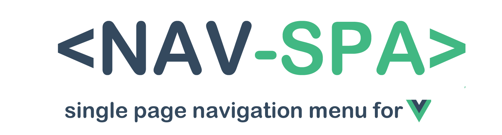

# Nav-Spa

- Highlight a menu item when you scroll at it's section.
- Smooth scroll to section when you click on a menu item. 

*Note: This package is modified version of [eddiemf/vue-scrollactive](https://github.com/eddiemf/vue-scrollactive)
plugin with some additional and modified functionality.*

## Installation

Install with your favourite package manager:

- Yarn: `yarn add vue-spa-nav`
- Npm: `npm -i vue-spa-nav`

## Usage

```javascript
import Vue from 'vue'
import VueSpaNav from './vue-nav-spa'

Vue.use(VueSpaNav)

```

Add `<nav-spa>` tag to your HTML, as you would add normal `<nav>` tag with
menu items you want to get highlighted during your scroll. All `<a>` tags
will be handled by this plugin (or see [advanced usage](#advanced-usage)).


## Advanced usage

### Define which links to handle

All links in `<nav-spa>` are handled by this plugin by default. If you want,
can add custom selector for link which you want to get handled, providing `link`
property at `<nav-spa>` tag.


**All links will be handled:**

```
<nav-spa>
  <a href="#foo">foo</a>
  <a href="#bar">bar</a>
</nav-spa>
```

**Only some links will be handled:**
```
<nav-spa link="custom-class">
  <a href="#foo" class="custom-class">foo</a>
  <a href="#bar">bar</a>
</nav-spa>
```

### Replacing hash instead of appending

Instead of pushing new hash into history, you can replace it.
```
<nav-spa link="custom-class" push-method="replaceState">
```

## Props

| attribute               | type     | default          | description
| ------------------------| -------- | -----------------|------------
| `active-class`          | String   | `active`         | CSS class displayed at the active link.
| `always-track`          | Boolean  | `false`          | Defines if the plugin should track the section change when clicking an item to scroll to its section. If set to true, it will always keep track and change the active class to the current section while scrolling, if false, the active class will be immediately applied to the clicked menu item, ignoring the passed sections until the scrolling is over.
| `bezier-easing-value`   | String   | `.5,0,.35,1`     | Your custom easing value for the click to scroll functionality. It must be a string with 4 values separated by commas in a cubic bezier format. Check [this tool](http://cubic-bezier.com) for generating values.
| `duration`              | Number   | `500`            | Duration of the scroll animation.
| `enabled`               | Boolean  | `true`           | Whether is event handler for click event enabled.
| `enabled-smooth-scroll` | Boolean  | `true`           | Whether the smooth scroll feature is enabled or not.
| `highlight-first-item`  | Boolean  | `true`           | Whether if the first item always highlighted.
| `link`                  | String   | `a[href^="#"]`   | Selector for links which observer for click event and added smooth scroll. By default all link in document are handled by smooth scroll.
| `offset`                | Number   | `0`              | Space between top of the window and the section. This is usually set to your fixed header height.
| `push-method`           | String   | `pushState`      | Which history API method will be used. pushState or replaceState?
| `scroll-container`      | String   | `null`           | Container of the sections, if omitted window will be used.
| `tag`                   | String   | `nav`            | Component tag, where will be the component rendered.
| `update-hash`           | Boolean  | `true`           | Update hash in URL when section is changed.

## Changelog

### 1.2.0
- [feature #1](https://github.com/arodax/vue-nav-spa/issues/1) Added `enabled-smooth-scroll` property to enable/disable smooth scrolling. 

### 1.1.0
- Added push-method property, allowing replacing history instead of overwriting it.
- Fixed missing `highlight-first-item` property.
- Added onPopState listener allowing to go back to previous hashes.  

## Licence

The MIT License (MIT)

Copyright (c) 2019-present, ARODAX a.s.

Copyright (c) 2017-2018 Mauricio Dziedzinski


Permission is hereby granted, free of charge, to any person obtaining a copy
of this software and associated documentation files (the "Software"), to deal
in the Software without restriction, including without limitation the rights
to use, copy, modify, merge, publish, distribute, sublicense, and/or sell
copies of the Software, and to permit persons to whom the Software is
furnished to do so, subject to the following conditions:

The above copyright notice and this permission notice shall be included in
all copies or substantial portions of the Software.

THE SOFTWARE IS PROVIDED "AS IS", WITHOUT WARRANTY OF ANY KIND, EXPRESS OR
IMPLIED, INCLUDING BUT NOT LIMITED TO THE WARRANTIES OF MERCHANTABILITY,
FITNESS FOR A PARTICULAR PURPOSE AND NONINFRINGEMENT. IN NO EVENT SHALL THE
AUTHORS OR COPYRIGHT HOLDERS BE LIABLE FOR ANY CLAIM, DAMAGES OR OTHER
LIABILITY, WHETHER IN AN ACTION OF CONTRACT, TORT OR OTHERWISE, ARISING FROM,
OUT OF OR IN CONNECTION WITH THE SOFTWARE OR THE USE OR OTHER DEALINGS IN
THE SOFTWARE.
